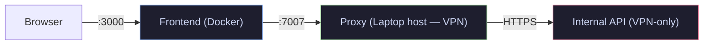

# backstage-field-api-select

A Backstage Scaffolder field extension that populates a dropdown from any external API via the Backstage proxy — with autocomplete, multiselect, dynamic params, and more.

Designed as a drop-in replacement for Roadie's `SelectFieldFromApi`, covering features it doesn't support:

| Feature | Roadie `SelectFieldFromApi` | `ApiSelectField` |
|---|---|---|
| Simple key=value params | ✅ | ✅ |
| Array params (`?key=a&key=b`) | ❌ | ✅ |
| Autocomplete / typeahead | ❌ | ✅ |
| Multiselect | ❌ | ✅ |
| `minItems` validation | ❌ | ✅ |
| Dynamic params from other fields | ❌ | ✅ |
| Dynamic path segments from other fields | ❌ | ✅ |
| No external dependency | ❌ | ✅ |

---

## Table of contents

- [Installation](#installation)
- [Setup](#setup)
- [Usage](#usage)
- [All `ui:options`](#all-uioptions)
- [Examples](#examples)
- [Try it locally](#try-it-locally)
- [Development](#development)

---

## Installation

```bash
npm install @cdelgehier/backstage-field-api-select
```

---

## Setup

### 1. Register the field extension

In `packages/app/src/App.tsx`, add `ApiSelectFieldExtension` inside `ScaffolderFieldExtensions`:

```tsx
import { ApiSelectFieldExtension } from '@cdelgehier/backstage-field-api-select';

// Inside your FlatRoutes:
<Route path="/create" element={<ScaffolderPage />}>
  <ScaffolderFieldExtensions>
    <ApiSelectFieldExtension />
  </ScaffolderFieldExtensions>
</Route>
```

### 2. Configure the proxy

In your `app-config.yaml`, expose the API you want to query via the Backstage proxy:

```yaml
proxy:
  endpoints:
    /my-api:
      target: https://my-internal-api.example.com
      changeOrigin: true
```

The field will call `${backstageProxyBase}/my-api/<path>`.

---

## Usage

Use `ui:field: ApiSelectField` in any Scaffolder template:

```yaml
parameters:
  - title: Choose a resource
    properties:
      bucket:
        title: S3 Bucket
        type: string
        ui:field: ApiSelectField
        ui:options:
          path: my-api/accounts/123456789/s3-buckets
          params:
            region_name: eu-west-1
            include_empty: 'true'
          arrayParams:
            exclude_patterns:
              - '^prod-logs-.*'
              - '^backup-.*'
          valueSelector: value
          labelSelector: label
```

---

## All `ui:options`

| Option | Type | Default | Description |
|---|---|---|---|
| `path` | `string` | **required** | API path appended to the proxy base URL. Supports `${{ parameters.xxx }}` for dynamic segments. |
| `params` | `Record<string, string>` | — | Static query parameters (`?key=value`). Values support `${{ parameters.xxx }}`. |
| `arrayParams` | `Record<string, string[]>` | — | Array query parameters (`?key=a&key=b`). Use when the API expects the same key repeated. |
| `arraySelector` | `string` | — | Dot-separated path into the response to reach the array. Example: `"data.items"`. |
| `valueSelector` | `string` | `"value"` | Key used as the option value from each item. |
| `labelSelector` | `string` | `"label"` | Key used as the option label. Falls back to `valueSelector` if absent. |
| `multiple` | `boolean` | `false` | Allow selecting more than one option. Requires `type: array` + `items: type: string`. |
| `minItems` | `number` | — | Minimum number of selections required (multiselect only). |
| `maxItems` | `number` | — | Maximum number of selections allowed (multiselect only). |
| `placeholder` | `string` | — | Placeholder text shown before the user makes a selection. |

---

## Examples

### Single select from a nested response

The API returns `{ result: { items: [{ id: "eu-west-1", name: "EU West 1" }, ...] } }`.

```yaml
region:
  title: AWS Region
  type: string
  ui:field: ApiSelectField
  ui:options:
    path: my-api/regions
    arraySelector: result.items
    valueSelector: id
    labelSelector: name
```

### Multiselect with a minimum selection

```yaml
securityGroups:
  title: Security Groups
  type: array
  items:
    type: string
  ui:field: ApiSelectField
  ui:options:
    path: my-api/accounts/123456789/security-groups
    params:
      region_name: eu-west-1
    arrayParams:
      exclude_patterns:
        - '^default$'
    multiple: true
    minItems: 1
    placeholder: Choose at least one security group…
```

### Dynamic param from another field

Use `${{ parameters.xxx }}` in `params` values — the field re-fetches automatically when the referenced field changes:

```yaml
subnet:
  title: Subnet
  type: string
  ui:field: ApiSelectField
  ui:options:
    path: my-api/subnets
    params:
      region_name: '${{ parameters.region }}'
      env: '${{ parameters.env }}'
    valueSelector: value
    labelSelector: label
```

### Dynamic path segment from another field

Use `${{ parameters.xxx }}` directly in `path` for path-parameter APIs:

```yaml
vpc:
  title: VPC
  type: string
  ui:field: ApiSelectField
  ui:options:
    path: my-api/accounts/123456789/vpcs
    valueSelector: value
    labelSelector: label

subnets:
  title: Subnets
  type: array
  items:
    type: string
  ui:field: ApiSelectField
  ui:options:
    path: my-api/accounts/123456789/vpcs/${{ parameters.vpc }}/subnets
    valueSelector: value
    labelSelector: label
    multiple: true
    minItems: 1
```

---

## Try it locally

Want to see the field in action before integrating? The demo runs in Docker — no local Node version constraint.

```bash
git clone https://github.com/cdelgehier/backstage-field-api-select.git
cd backstage-field-api-select
task backstage:setup   # builds the plugin and the Docker image (~10 min, once)
task backstage:start   # frontend on :3000 + proxy on :7007
```

> `task backstage:setup` must be re-run whenever the plugin source changes.

`task backstage:start` runs **two processes inside the same container**: the Backstage frontend on port 3000 and a lightweight proxy on port 7007. The proxy forwards `/api/proxy/demo-api/*` to `PROXY_TARGET` (default: [jsonplaceholder.typicode.com](https://jsonplaceholder.typicode.com)).

To point the demo at a different API, pass `PROXY_TARGET` at build time:

```bash
task backstage:setup PROXY_TARGET=https://my-api.example.com
```

#### Using a VPN-only or internal API

Docker containers run in an isolated network (Lima VM on macOS) and **cannot reach VPN-protected hosts**. Run the proxy on your Mac (which has VPN access) and the frontend in Docker:

```bash
# Terminal 1 — proxy on the host (has VPN access), port 7007
task backstage:proxy PROXY_TARGET=https://my-internal-api.example.com

# Terminal 2 — frontend only in Docker, port 3000 (no proxy inside)
task backstage:start:frontend
```



#### Try the full example template

Open the Template Editor at [http://localhost:3000/create/template-form](http://localhost:3000/create/template-form) and paste the block below.

> **What is `demo-api`?**
> `demo-api` is the proxy prefix configured in the demo's `app-config.yaml`. In a real Backstage app, replace it with the key you define under `proxy.endpoints` in your own `app-config.yaml`.

> The Template Editor accepts only `parameters:` + `steps:` — leave out `apiVersion / kind / metadata / spec`.

<details>
<summary>Show full demo template</summary>

```yaml
parameters:
  - title: Full ApiSelectField demo
    properties:

      # --- Single select, flat array response ----------------------------
      single_select:
        title: Single select (flat array)
        type: string
        ui:field: ApiSelectField
        ui:options:
          path: demo-api/posts
          valueSelector: id
          labelSelector: title

      # --- Single select, nested response --------------------------------
      nested_response:
        title: Single select (nested response)
        type: string
        ui:field: ApiSelectField
        ui:options:
          path: demo-api/posts
          arraySelector: ''
          valueSelector: id
          labelSelector: title

      # --- Static query parameters ---------------------------------------
      with_params:
        title: With static query params
        type: string
        ui:field: ApiSelectField
        ui:options:
          path: demo-api/posts
          params:
            userId: '1'
            _limit: '5'
          valueSelector: id
          labelSelector: title

      # --- Array query parameters ----------------------------------------
      with_array_params:
        title: With array query params
        type: string
        ui:field: ApiSelectField
        ui:options:
          path: demo-api/posts
          arrayParams:
            id:
              - '1'
              - '2'
              - '3'
          valueSelector: id
          labelSelector: title

      # --- Placeholder text -----------------------------------------------
      with_placeholder:
        title: With placeholder
        type: string
        ui:field: ApiSelectField
        ui:options:
          path: demo-api/posts
          valueSelector: id
          labelSelector: title
          placeholder: Start typing to search…

      # --- Multiselect ----------------------------------------------------
      multiselect:
        title: Multiselect
        type: array
        items:
          type: string
        ui:field: ApiSelectField
        ui:options:
          path: demo-api/posts
          valueSelector: id
          labelSelector: title
          multiple: true

      # --- Multiselect with min/max ----------------------------------------
      multiselect_min:
        title: Multiselect (min 2, max 4)
        type: array
        items:
          type: string
        ui:field: ApiSelectField
        ui:options:
          path: demo-api/posts
          valueSelector: id
          labelSelector: title
          multiple: true
          minItems: 2
          maxItems: 4
          placeholder: Pick between 2 and 4…

      # --- Dynamic query param from another field -------------------------
      dynamic_param:
        title: Dynamic param (depends on single_select above)
        type: string
        ui:field: ApiSelectField
        ui:options:
          path: demo-api/comments
          params:
            postId: '${{ parameters.single_select }}'
          valueSelector: id
          labelSelector: name

steps:
  - id: log
    name: Log selections
    action: debug:log
    input:
      message: |
        single_select:      ${{ parameters.single_select }}
        nested_response:    ${{ parameters.nested_response }}
        with_params:        ${{ parameters.with_params }}
        with_array_params:  ${{ parameters.with_array_params }}
        multiselect:        ${{ parameters.multiselect }}
        multiselect_min:    ${{ parameters.multiselect_min }}
        dynamic_param:      ${{ parameters.dynamic_param }}
```

</details>

---

## Development

### Prerequisites

- [Node.js](https://nodejs.org/) 20+
- [Task](https://taskfile.dev/) — task runner (`brew install go-task`)
- [pre-commit](https://pre-commit.com/) — git hooks (`brew install pre-commit` or `pip install pre-commit`)

### Setup

```bash
git clone https://github.com/cdelgehier/backstage-field-api-select.git
cd backstage-field-api-select

task install

# Install git hooks (run once after cloning)
pre-commit install
pre-commit install --hook-type commit-msg
```

### Available tasks

| Task | Description |
|---|---|
| `task install` | Install all dependencies |
| `task build` | Compile the package to `dist/` |
| `task test` | Run all tests |
| `task test:watch` | Run tests in watch mode |
| `task test:coverage` | Run tests with coverage report |
| `task lint` | Check code style with ESLint |
| `task type-check` | Check TypeScript types |
| `task ci` | Full CI pipeline (lint + type-check + test) |
| `task clean` | Remove all build artifacts |
| `task backstage:setup` | Build the plugin and Docker demo image (re-run after source changes) |
| `task backstage:start` | Start the demo (frontend + proxy for jsonplaceholder) |
| `task backstage:proxy` | Run the proxy on the host — use for VPN-protected APIs |
| `task backstage:start:frontend` | Start only the frontend — pair with `backstage:proxy` |

### Commit convention

Commits must follow the [Conventional Commits](https://www.conventionalcommits.org/) spec — enforced by the `commitizen` pre-commit hook and verified by CI on every push and PR.

```bash
git commit -m "feat: add support for dynamic params from other fields"
git commit -m "fix: avoid re-fetch when unrelated props change"
git commit -m "docs: add multiselect example to README"
```

---

## License

MIT © [Cédric Delgehier](https://github.com/cdelgehier)
