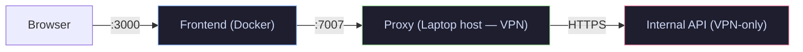

# backstage-field-api-select

Two Backstage Scaffolder field extensions:

- **`ApiSelectField`** — populates a dropdown from any external API via the Backstage proxy, with autocomplete, multiselect, dynamic path and param substitution.
- **`CascadeSelectField`** — renders two dependent static selects in a single component, solving the rjsf rendering order limitation that affects `dependencies.oneOf`.

Designed as a drop-in replacement for Roadie's `SelectFieldFromApi`, covering features it doesn't support:

| Feature | Roadie `SelectFieldFromApi` | `ApiSelectField` |
|---|---|---|
| Simple key=value params | ✅ | ✅ |
| Array params (`?key=a&key=b`) | ❌ | ✅ |
| Autocomplete / typeahead | ❌ | ✅ |
| Multiselect | ❌ | ✅ |
| `minItems` / `maxItems` validation | ❌ | ✅ |
| Dynamic params from other fields | ❌ | ✅ |
| Dynamic path segments from other fields | ❌ | ✅ |
| Dotted path references (`parameters.obj.prop`) | ❌ | ✅ |
| Cascade static selects (ordering fix) | ❌ | ✅ (`CascadeSelectField`) |

---

## Table of contents

- [Installation](#installation)
- [Setup](#setup)
- [ApiSelectField](#apiselectfield)
  - [Usage](#usage)
  - [All `ui:options`](#all-uioptions)
  - [Examples](#examples)
- [CascadeSelectField](#cascadeselectfield)
  - [The problem it solves](#the-problem-it-solves)
  - [Usage](#usage-1)
  - [All `ui:options`](#all-uioptions-1)
  - [Referencing values in subsequent fields](#referencing-values-in-subsequent-fields)
- [Try it locally](#try-it-locally)
- [Development](#development)

---

## Installation

```bash
npm install @cdelgehier/backstage-field-api-select
```

---

## Setup

This plugin targets the **new Backstage frontend system** (`@backstage/frontend-defaults`).

### Auto-discovery (recommended)

If your app uses `app.packages: all` in `app-config.yaml`, no code changes are needed — the plugin is loaded automatically after installation:

```yaml
# app-config.yaml
app:
  packages: all
```

### Manual registration

If you manage features explicitly, import the default export and add it to `features`:

```tsx
// packages/app/src/App.tsx
import { createApp } from '@backstage/frontend-defaults';
import ApiSelectFieldExtension from '@cdelgehier/backstage-field-api-select';

export default createApp({
  features: [ApiSelectFieldExtension],
});
```

`ApiSelectFieldExtension` registers both `ApiSelectField` and `CascadeSelectField` — a single import covers both.

Configure the Backstage proxy to expose the API you want to query:

```yaml
proxy:
  endpoints:
    /my-api:
      target: https://my-internal-api.example.com
      changeOrigin: true
```

---

## ApiSelectField

### Usage

```yaml
parameters:
  - title: Choose a resource
    properties:
      bucket:
        title: S3 Bucket
        type: string
        ui:field: ApiSelectField
        ui:options:
          path: my-api/accounts/123456789/s3-buckets
          params:
            region_name: eu-west-1
          valueSelector: value
          labelSelector: label
```

### All `ui:options`

| Option | Type | Default | Description |
|---|---|---|---|
| `path` | `string` | **required** | API path appended to the proxy base URL. Supports `${{ parameters.xxx }}` and `${{ parameters.obj.prop }}` for dynamic segments. |
| `params` | `Record<string, string>` | — | Static query parameters (`?key=value`). Values support `${{ parameters.xxx }}`. |
| `arrayParams` | `Record<string, string[]>` | — | Array query parameters (`?key=a&key=b`). Use when the API expects the same key repeated. |
| `arraySelector` | `string` | — | Dot-separated path into the response to reach the array. Example: `"data.items"`. |
| `valueSelector` | `string` | `"value"` | Key used as the option value from each item. |
| `labelSelector` | `string` | `"label"` | Key used as the option label. Falls back to `valueSelector` if absent. |
| `multiple` | `boolean` | `false` | Allow selecting more than one option. Requires `type: array` + `items: type: string`. |
| `minItems` | `number` | — | Minimum number of selections required (multiselect only). |
| `maxItems` | `number` | — | Maximum number of selections allowed (multiselect only). |
| `placeholder` | `string` | — | Placeholder text shown before the user makes a selection. |

### Examples

#### Single select, dynamic path segment

```yaml
account:
  title: AWS Account
  type: string
  ui:field: ApiSelectField
  ui:options:
    path: my-api/organizations/my-ou/accounts

region:
  title: AWS Region
  type: string
  ui:field: ApiSelectField
  ui:options:
    path: my-api/accounts/${{ parameters.account }}/regions
```

When `account` is not yet selected, `region` skips the fetch (the empty path segment guard prevents calling `/accounts//regions`).

#### Multiselect with min/max enforcement

```yaml
subnet_ids:
  title: Database Subnets
  description: Select at least 2 subnets in different Availability Zones.
  type: array
  minItems: 2
  default: []
  items:
    type: string
  ui:field: ApiSelectField
  ui:options:
    path: my-api/accounts/${{ parameters.account }}/subnets
    params:
      region_name: ${{ parameters.region }}
    multiple: true
    minItems: 2
```

`minItems` and `maxItems` in `ui:options` show inline validation messages. Add them at the JSON Schema level too (`minItems: 2` on the field) to have rjsf block the **Next** button.

#### Dynamic param from another field

```yaml
subnets:
  title: Subnet
  type: string
  ui:field: ApiSelectField
  ui:options:
    path: my-api/accounts/${{ parameters.account }}/subnets
    params:
      region_name: ${{ parameters.region }}
    valueSelector: value
    labelSelector: label
```

The field re-fetches automatically whenever `account` or `region` changes. If the previously selected value is no longer in the new options, it is cleared automatically.

#### Dotted path reference to a `CascadeSelectField` value

```yaml
images:
  title: Base Image
  type: string
  ui:field: ApiSelectField
  ui:options:
    path: my-api/accounts/${{ parameters.account }}/images
    params:
      os: ${{ parameters.os_combo.secondary }}
```

`${{ parameters.os_combo.secondary }}` reads the `secondary` property of an `os_combo` field returned by `CascadeSelectField`. Dotted paths up to any depth are supported.

#### Array query parameters

```yaml
instances:
  title: Instance Type
  type: string
  ui:field: ApiSelectField
  ui:options:
    path: my-api/instance-types
    arrayParams:
      families:
        - t3
        - m5
        - r5
```

Produces `?families=t3&families=m5&families=r5` — one key repeated per value, as many APIs expect.

---

## CascadeSelectField

### The problem it solves

In rjsf (used by Backstage), fields injected via `dependencies.oneOf` **always render after all `properties` fields**, regardless of their position in the YAML. This breaks the expected visual flow when one static enum depends on another:

```
# What you write in YAML:    # What the user sees without CascadeSelectField:
os_type                       os_type       ✅
os_distro   ← dependency      other_field   ← wrong order
other_field                   os_distro     ← always at the bottom
```

`CascadeSelectField` combines both selects into a single component, eliminating the need for `dependencies.oneOf` entirely and preserving declaration order.

### Usage

```yaml
parameters:
  - title: Operating System
    required:
      - os_combo
    properties:
      os_combo:
        title: Operating System
        type: object
        ui:field: CascadeSelectField
        ui:options:
          primary:
            label: OS Family
            options:
              - { value: linux,   label: Linux }
              - { value: windows, label: Windows Server }
          secondary:
            label: Distribution
            optionsByPrimary:
              linux:
                - { value: amzn2,  label: Amazon Linux 2 (amzn2) }
                - { value: al2023, label: Amazon Linux 2023 (al2023) }
                - { value: rhel,   label: Red Hat (rhel) }
                - { value: ubuntu, label: Ubuntu }
                - { value: oracle, label: Oracle }
              windows:
                - { value: windows-w2k22, label: Windows Server 2022 (w2k22) }
                - { value: windows-w2k19, label: Windows Server 2019 (w2k19) }
```

The field returns `{ primary: "linux", secondary: "ubuntu" }` as the value for `os_combo`.

### All `ui:options`

| Option | Type | Required | Description |
|---|---|---|---|
| `primary.label` | `string` | — | Label for the first select. Falls back to the field's `title`. |
| `primary.options` | `{ value, label }[]` | ✅ | Static list of options for the first select. |
| `secondary.label` | `string` | — | Label for the second select. |
| `secondary.optionsByPrimary` | `Record<string, { value, label }[]>` | ✅ | Map of primary value → secondary options. The second select is disabled until the first is chosen. |

When the primary selection changes, the secondary is automatically reset if its current value is no longer valid.

### Referencing values in subsequent fields

Reference each part of the returned object with dotted notation in any `ApiSelectField` path or params:

```yaml
# os_combo.primary → "linux" or "windows"
# os_combo.secondary → "ubuntu", "rhel", "windows-w2k22", …

images:
  title: Base Image
  type: string
  ui:field: ApiSelectField
  ui:options:
    path: my-api/accounts/${{ parameters.account }}/images
    params:
      os: ${{ parameters.os_combo.secondary }}
```

Reference in steps:

```yaml
steps:
  - action: debug:log
    input:
      message: |
        OS family    : ${{ parameters.os_combo.primary }}
        Distribution : ${{ parameters.os_combo.secondary }}
```

---

## Try it locally

Want to see the fields in action before integrating? The demo runs in Docker — no local Node version constraint.

```bash
git clone https://github.com/cdelgehier/backstage-field-api-select.git
cd backstage-field-api-select
task backstage:setup   # builds the plugin and the Docker image (~10 min, once)
task backstage:start   # frontend on :3000 + proxy on :7007
```

> `task backstage:setup` must be re-run whenever the plugin source changes.

`task backstage:start` runs **two processes inside the same container**: the Backstage frontend on port 3000 and a lightweight proxy on port 7007. The proxy forwards `/api/proxy/demo-api/*` to `PROXY_TARGET` (default: [jsonplaceholder.typicode.com](https://jsonplaceholder.typicode.com)).

To point the demo at a different API, pass `PROXY_TARGET` at build time:

```bash
task backstage:setup PROXY_TARGET=https://my-api.example.com
```

#### Using a VPN-only or internal API

Docker containers run in an isolated network (Lima VM on macOS) and **cannot reach VPN-protected hosts**. Run the proxy on your Mac (which has VPN access) and the frontend in Docker:

```bash
# Terminal 1 — proxy on the host (has VPN access), port 7007
task backstage:proxy PROXY_TARGET=https://my-internal-api.example.com

# Terminal 2 — frontend only in Docker, port 3000 (no proxy inside)
task backstage:start:frontend
```


```mermaid
flowchart LR
    Browser -->|":3000"| FE["Frontend (Docker)"]
    FE -->|":7007"| Proxy["Proxy (Laptop host — VPN)"]
    Proxy -->|"HTTPS"| API["Internal API (VPN-only)"]

    style FE fill:#1e1e2e,stroke:#89b4fa,color:#cdd6f4
    style Proxy fill:#1e1e2e,stroke:#a6e3a1,color:#cdd6f4
    style API fill:#1e1e2e,stroke:#f38ba8,color:#cdd6f4
```

#### Try the full example template

Open the Template Editor at [http://localhost:3000/create/template-form](http://localhost:3000/create/template-form) and paste the block below.

> **What is `demo-api`?**
> `demo-api` is the proxy prefix configured in the demo's `app-config.yaml`. In a real Backstage app, replace it with the key you define under `proxy.endpoints` in your own `app-config.yaml`.

> The Template Editor accepts only `parameters:` + `steps:` — leave out `apiVersion / kind / metadata / spec`.

<details>
<summary>Show full ApiSelectField demo template</summary>

```yaml
parameters:
  - title: Full ApiSelectField demo
    properties:

      # --- Single select, flat array response ----------------------------
      single_select:
        title: Single select (flat array)
        type: string
        ui:field: ApiSelectField
        ui:options:
          path: demo-api/posts
          valueSelector: id
          labelSelector: title

      # --- Static query parameters ---------------------------------------
      with_params:
        title: With static query params
        type: string
        ui:field: ApiSelectField
        ui:options:
          path: demo-api/posts
          params:
            userId: '1'
            _limit: '5'
          valueSelector: id
          labelSelector: title

      # --- Array query parameters ----------------------------------------
      with_array_params:
        title: With array query params
        type: string
        ui:field: ApiSelectField
        ui:options:
          path: demo-api/posts
          arrayParams:
            id:
              - '1'
              - '2'
              - '3'
          valueSelector: id
          labelSelector: title

      # --- Placeholder text -----------------------------------------------
      with_placeholder:
        title: With placeholder
        type: string
        ui:field: ApiSelectField
        ui:options:
          path: demo-api/posts
          valueSelector: id
          labelSelector: title
          placeholder: Start typing to search…

      # --- Multiselect ----------------------------------------------------
      multiselect:
        title: Multiselect
        type: array
        items:
          type: string
        ui:field: ApiSelectField
        ui:options:
          path: demo-api/posts
          valueSelector: id
          labelSelector: title
          multiple: true

      # --- Multiselect with min/max ----------------------------------------
      multiselect_min:
        title: Multiselect (min 2, max 4)
        type: array
        minItems: 2
        default: []
        items:
          type: string
        ui:field: ApiSelectField
        ui:options:
          path: demo-api/posts
          valueSelector: id
          labelSelector: title
          multiple: true
          minItems: 2
          maxItems: 4
          placeholder: Pick between 2 and 4…

      # --- Dynamic query param from another field -------------------------
      dynamic_param:
        title: Dynamic param (depends on single_select above)
        type: string
        ui:field: ApiSelectField
        ui:options:
          path: demo-api/comments
          params:
            postId: '${{ parameters.single_select }}'
          valueSelector: id
          labelSelector: name

steps:
  - id: log
    name: Log selections
    action: debug:log
    input:
      message: |
        single_select:      ${{ parameters.single_select }}
        with_params:        ${{ parameters.with_params }}
        with_array_params:  ${{ parameters.with_array_params }}
        multiselect:        ${{ parameters.multiselect }}
        multiselect_min:    ${{ parameters.multiselect_min }}
        dynamic_param:      ${{ parameters.dynamic_param }}
```

</details>

<details>
<summary>Show full CascadeSelectField demo template</summary>

```yaml
parameters:
  - title: Operating System
    required:
      - os_combo
    properties:
      os_combo:
        title: Operating System
        type: object
        ui:field: CascadeSelectField
        ui:options:
          primary:
            label: OS Family
            options:
              - { value: linux,   label: Linux }
              - { value: windows, label: Windows Server }
          secondary:
            label: Distribution
            optionsByPrimary:
              linux:
                - { value: amzn2,  label: "Amazon Linux 2 (amzn2)" }
                - { value: al2023, label: "Amazon Linux 2023 (al2023)" }
                - { value: rhel,   label: "Red Hat (rhel)" }
                - { value: ubuntu, label: Ubuntu }
              windows:
                - { value: windows-w2k22, label: "Windows Server 2022 (w2k22)" }
                - { value: windows-w2k19, label: "Windows Server 2019 (w2k19)" }

steps:
  - id: log
    name: Log selections
    action: debug:log
    input:
      message: |
        os_family    : ${{ parameters.os_combo.primary }}
        distribution : ${{ parameters.os_combo.secondary }}
```

</details>

---

## Development

### Prerequisites

- [Node.js](https://nodejs.org/) 20+
- [Task](https://taskfile.dev/) — task runner (`brew install go-task`)
- [pre-commit](https://pre-commit.com/) — git hooks (`brew install pre-commit` or `pip install pre-commit`)

### Setup

```bash
git clone https://github.com/cdelgehier/backstage-field-api-select.git
cd backstage-field-api-select

task install

# Install git hooks (run once after cloning)
pre-commit install
pre-commit install --hook-type commit-msg
```

### Available tasks

| Task | Description |
|---|---|
| `task install` | Install all dependencies |
| `task build` | Compile the package to `dist/` |
| `task test` | Run all tests |
| `task test:watch` | Run tests in watch mode |
| `task test:coverage` | Run tests with coverage report |
| `task lint` | Check code style with ESLint |
| `task type-check` | Check TypeScript types |
| `task ci` | Full CI pipeline (lint + type-check + test) |
| `task clean` | Remove all build artifacts |
| `task backstage:setup` | Build the plugin and Docker demo image (re-run after source changes) |
| `task backstage:start` | Start the demo (frontend + proxy for jsonplaceholder) |
| `task backstage:proxy` | Run the proxy on the host — use for VPN-protected APIs |
| `task backstage:start:frontend` | Start only the frontend — pair with `backstage:proxy` |

### Commit convention

Commits must follow the [Conventional Commits](https://www.conventionalcommits.org/) spec — enforced by the `commitizen` pre-commit hook and verified by CI on every push and PR.

```bash
git commit -m "feat: add support for dynamic params from other fields"
git commit -m "fix: avoid re-fetch when unrelated props change"
git commit -m "docs: add multiselect example to README"
```

---

## License

MIT © [Cédric Delgehier](https://github.com/cdelgehier)
